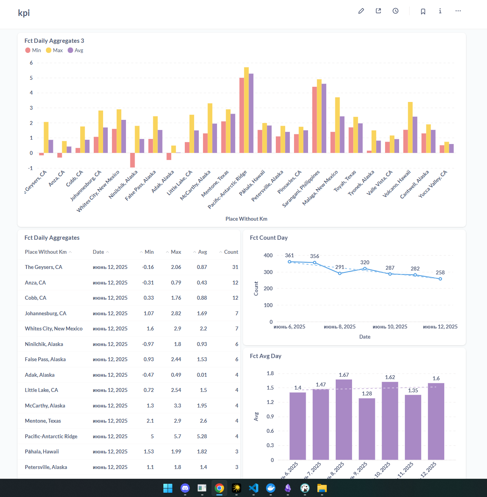

# Pet Project: Earthquake Data Pipeline
Проект представляет собой автоматизированную ETL-систему для сбора, обработки и визуализации данных о землетрясениях из USGS API.  

  

## 📊 Архитектура решения

```plaintext
USGS API → S3 (MinIO) → PostgreSQL (DWH) → Агрегаты в DM слое → Metabase
```

## 📦 Компоненты системы

Airflow DAGs  
  
raw_from_api_to_s3.py - Загрузка данных из USGS API в S3 хранилище  
raw_from_s3_to_pg.py - Импорт данных из S3 в DWH (PostgreSQL)  
fct_avg_day.py - Расчет средней магнитуды землетрясений по дням  
fct_count_day.py - Подсчет количества землетрясений по дням  
fct_daily_aggregates.py - Комплексная агрегация данных по местоположениям  

## 🛠️ Инфраструктура

Apache Airflow - Оркестрация ETL-процессов  
PostgreSQL - Хранилище данных и метаданных Airflow  
MinIO - S3-совместимое хранилище для сырых данных  
Metabase - BI-система для визуализации данных  

## 🚀 Установка и запуск

```bash
py -3.12 -m venv venv
.\venv\Scripts\activate
pip install -r req.txt
docker compose up -d
```

## Доступ к сервисам:

* Airflow UI: http://localhost:8080  
* MinIO UI: http://localhost:9001  
* Metabase: http://localhost:3000  

## Переменные окружения

Создайте в Airflow следующие Variables:  
* access_key - ключ доступа MinIO  
* secret_key - секретный ключ MinIO  
* pg_password - пароль PostgreSQL для DWH  
